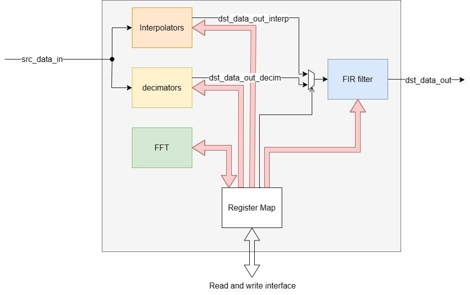
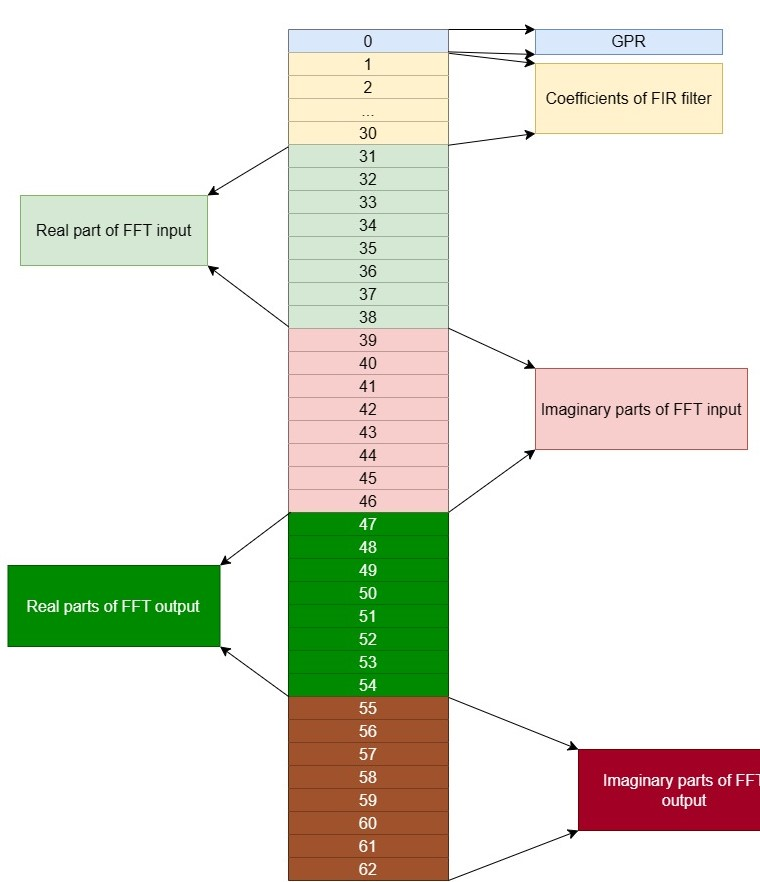

# Pak-DSP

Pak-DSP is a digital signal processor capable of increasing sampling rate and decreasing sampling rate of a signal. It is also capable of performing FFT (Fast Fourier Transform) of a time domain signal to show its frequency domain equivalent. Architecture level view of Pak-DSP can be view in the image below:



## Features
- FFT: N-point decimation in frequency (DIF) Fast Fourier Transform, where N can be configured through a parameter.
- Decimation: Pak-DSP supports configurable decimation rates of 1, 2, 4 and 8.
- Interpolation: Pak-DSP supports configurable interpolation rates of 1, 2, 4 and 8.


## Pak-DSP Register Map
The memory map of Pak-DSP is displayed in the following picture:



Where GPR is composed of:


## How to use this project?
Clone the repository:  

```
git clone https://github.com/AhsanAliUet/pak-dsp.git
```  

Go to the `verif` directory:  

```
cd pak-dsp/verif/
```  

Build and Run:  

```
make DUT=pak_dsp
```

To run unit tests, the following commands can be used:  

```
make DUT=<name_of_module_to_be_tested>
make DUT=fft_8p
make DUT=duc
make DUT=ddc
```

Where `fft_8p` is chooses FFT with 8 points, `duc` is digital up converter (interpolators) and `ddc` is digital down converter (decimators).

To enable debugging, an additional flag `DEBUG=on` can be used with the `make` command like:
```
make DUT=fft_8p DEBUG=on
```

Please note that Pak-DSP is an open-source digital signal processor and uses everything that is opensource like it uses simulator as Verilator.

## Application
Pak-DSP can be used in multiple real world applications like image processing and signal conditioning applications.

## Questions?
Do reach us in [issues](https://github.com/AhsanAliUet/pak-dsp/issues) section.
